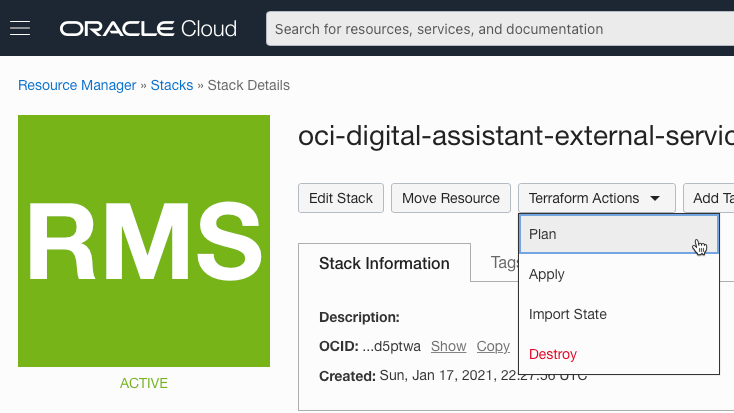
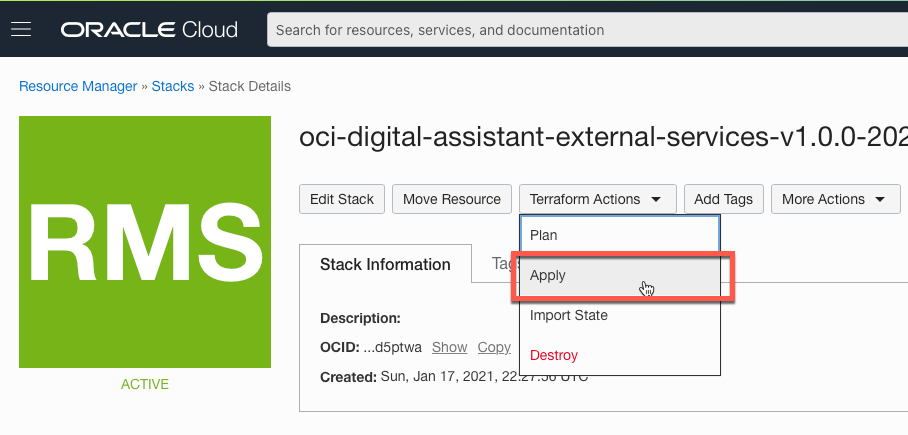
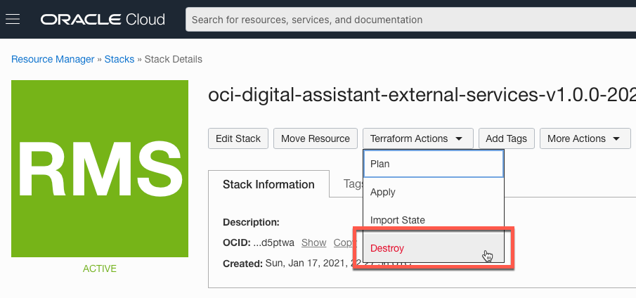

# Oracle Digital Assistant External Services

## Introduction

TThis solution shows how to provision and configure the infrastructure that you need to deploy [Digital Assistant](https://docs.oracle.com/en-us/iaas/digital-assistant/index.html) custom components/webviews to [Oracle Kubernetes Engine (**_OKE_**)](https://docs.oracle.com/en-us/iaas/Content/ContEng/Concepts/contengoverview.htm) using either [Oracle Cloud Infrastructure Resource Manager](https://docs.cloud.oracle.com/en-us/iaas/Content/ResourceManager/Concepts/resourcemanager.htm) or [Terraform](https://www.terraform.io/docs/providers/oci/index.html). You also can use this infrastructure to deploy different utility services that Digital Assistant can benefit from, like custom channel webhook implementations.

The following list shows all the artifacts that will be provisioned.

| Component                                                                                                           | Description                                         | Default Name             
|---------------------------------------------------------------------------------------------------------------------|-----------------------------------------------------|-------------------------
| [API Gateway](https://docs.cloud.oracle.com/en-us/iaas/Content/APIGateway/Concepts/apigatewayconcepts.htm)          | Oracle Cloud Infrastructure API Gateway             | Digital Assistant API Gateway 
| [Vault](https://docs.oracle.com/en-us/iaas/Content/KeyManagement/Concepts/keyoverview.htm#Overview_of_Vault)        | Oracle Cloud Infrastructure Vault                   | Digital Assistant Vault 
| [VCN](https://docs.cloud.oracle.com/en-us/iaas/Content/Network/Tasks/managingVCNs.htm#VCNsandSubnets)               | Oracle Cloud Infrastructure VCN                     | Digital Assistant VCN
| [Subnets](https://docs.cloud.oracle.com/en-us/iaas/Content/Network/Tasks/managingVCNs.htm#VCNsandSubnets)           | Oracle Cloud Infrastructure VCN Subnets             | Digital Assistant - Public <br>Digital Assistant - Private <br>Digital Assistant (OKE LB) - Private
| [Dynamic Group](https://docs.cloud.oracle.com/en-us/iaas/Content/Identity/Tasks/managingdynamicgroups.htm)          | Oracle Cloud Infrastructure Dynamic Group           | DigitalAssistantDynamicGroup 
| [Policies (compartment)](https://docs.cloud.oracle.com/en-us/iaas/Content/Identity/Concepts/policygetstarted.htm)   | Oracle Cloud Infrastructure Security Policies       | DigitalAssistantPolicies

## Prerequisite

- You must belong to a user group with tenancy administrator privileges to complete these steps.
- Make sure that the newly provisioned artifacts won't cause your tenancy to exceed its service limits.

## Provision infrastructure using Oracle Resource Manager (ORM)

1. Download [`oci-digital-assistant-external-services-v1.0.0.zip`](../../releases/download/v1.0.0/oci-digital-assistant-external-services-v1.0.0.zip) file
1. From Oracle Cloud Infrastructure **Console/Resource Manager**, create a new stack.
1. Make sure you select **My Configurations** and then upload the zip file downloaded in the previous step.
1. Set a name for the stack and click Next.
1. Set the required variables values and then click Create.
    

1. From the stack details page, click **Terraform Actions**, and then click **Plan**. Ensure that the action completes successfully.
    

1. From the stack details page, click **Terraform Actions**, and then click **Apply**. Ensure that the action completes successfully.
    

### Destroying The Infrastructure

If you later decide to delete the created artifacts, click **Terraform Actions**, and then click **Destroy**. Ensure that the action completes successfully.
    

## Provision infrastructure using Terraform

1. Clone this repo

   ```
   git clone git clone git clone git@github.com:oracle-quickstart/oci-digital-assistant-external-services.git
   cd oci-digital-assistant-external-services/deploy/terraform
   ```

1. Create a copy of the **oci-digital-assistant-external-services/terraform.tfvars.example** file in the same directory and name it **terraform.tfvars**.
1. Open the newly created **oci-digital-assistant-external-services/terraform.tfvars** file and add your Oracle Cloud Infrastructure user and tenant details to the TF Requirements section.

        ```
           #*************************************
           #           TF Requirements
           #*************************************
           
           // Oracle Cloud Infrastructure Region, user "Region Identifier" as documented here https://docs.cloud.oracle.com/en-us/iaas/Content/General/Concepts/regions.htm
           region=""
           // The Compartment OCID to provision artificats within
           compartment_ocid=""
           // Oracle Cloud Infrastructure User OCID, more details can be found at https://docs.cloud.oracle.com/en-us/iaas/Content/API/Concepts/apisigningkey.htm#five
           user_ocid=""
           // Oracle Cloud Infrastructure tenant OCID, more details can be found at https://docs.cloud.oracle.com/en-us/iaas/Content/API/Concepts/apisigningkey.htm#five
           tenancy_ocid=""
           // Path to private key used to create Oracle Cloud Infrastructure "API Key", more details can be found at https://docs.cloud.oracle.com/en-us/iaas/Content/General/Concepts/credentials.htm#two
           private_key_path=""
           // "API Key" fingerprint, more details can be found at https://docs.cloud.oracle.com/en-us/iaas/Content/General/Concepts/credentials.htm#two
           fingerprint=""
        ```

1. Run this command to Initialize the Terraform provider:

   ```shell
    terraform init
   ```

1. To see what components you'll create, and to verify that you can run the terraform scripts successfully, run this command:

    ```shell
    terraform plan
   ```

1. To execute the Terraform scripts, run this command:

    ```shell
    terraform apply -auto-approve
   ```

### Destroying the infrastructure

If you later decide to delete the created artifacts, run this command:

```shell
    terraform destroy -auto-approve
```
